# Projeto Integrador - Prototipação e UML
### Modelagem de Sistema para Gestão de Dados de Uma Universidade
---
## Prototipação e Requisitos
### 1. Tela inicial

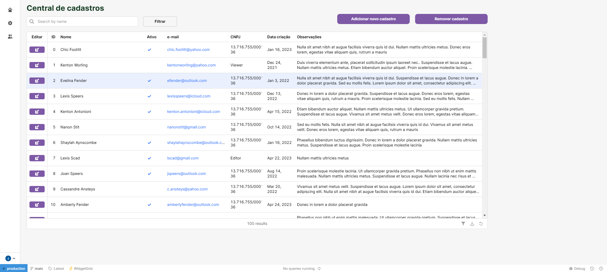
---
### 2. Atores envolvidos:
- **Pessoa Física:** Alunos e professores, precisam ser cadastrados para acessar os recursos acadêmicos e administrativos.
- **Pessoa Jurídica:** Empresas ou instituições, como fornecedores, que precisam ser cadastradas para fornecer serviços ou produtos à universidade.
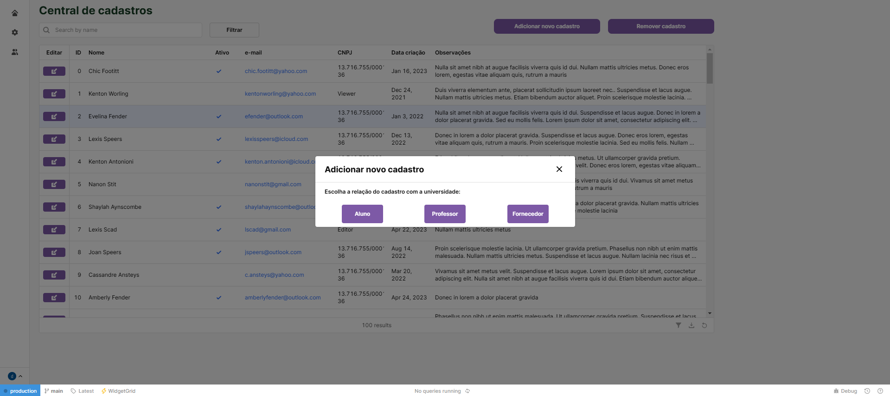
---
### 3. Cenários contemplados no diagrama de caso de uso:
1.  Cadastro de Professores:

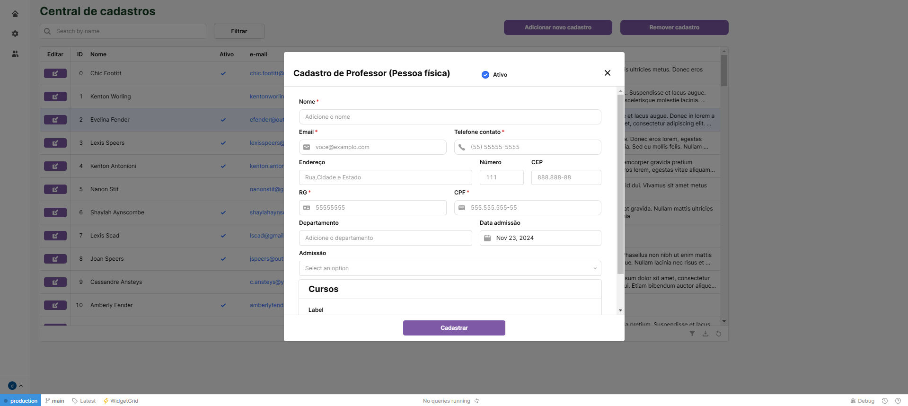
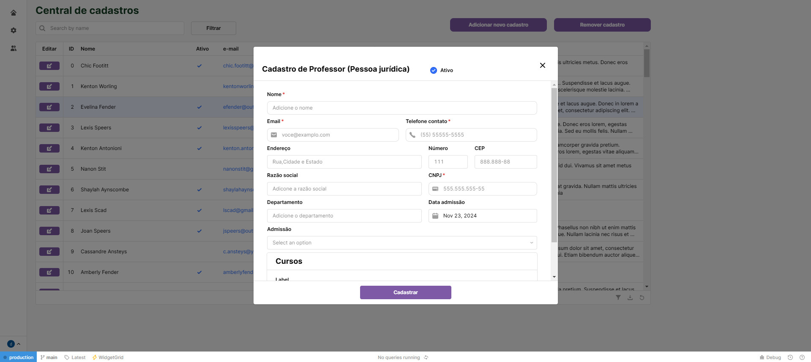

2.  Cadastro de Alunos:
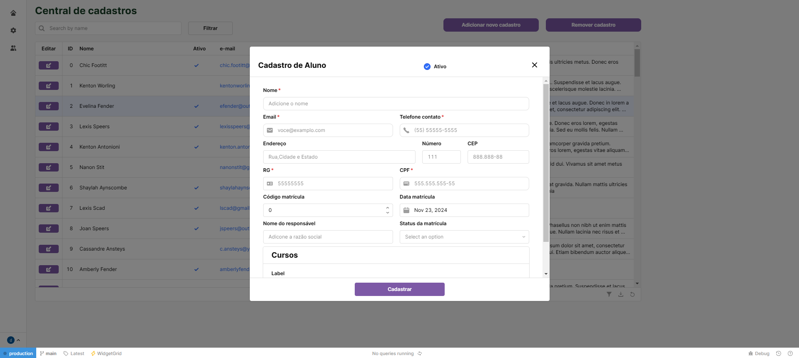

3. Cadastro de Fornecedores:  
- **Cadastro de Pessoa Física (CPF)**  
- **Cadastro de Pessoa Jurídica (CNPJ)**
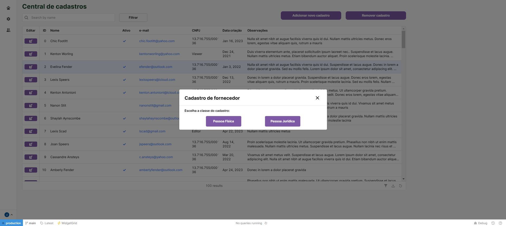
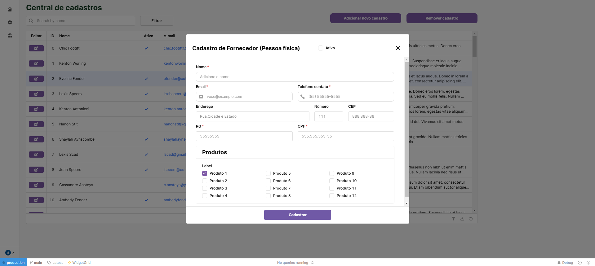
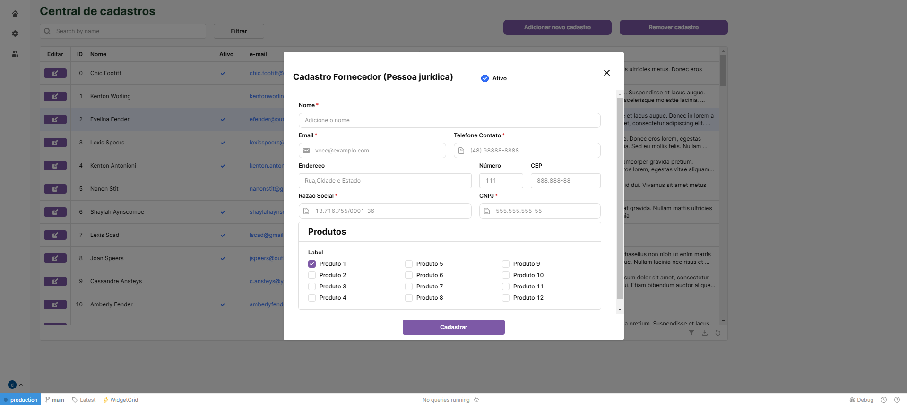

4. Remover Cadastros Realizados
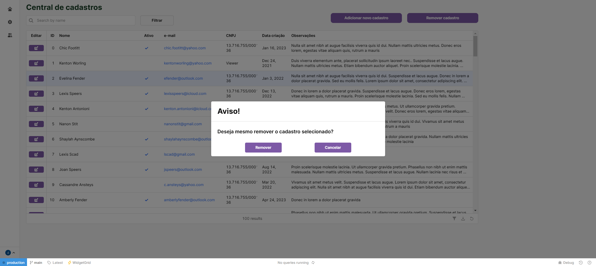
---
### 4. Diagrama de Caso de Uso:
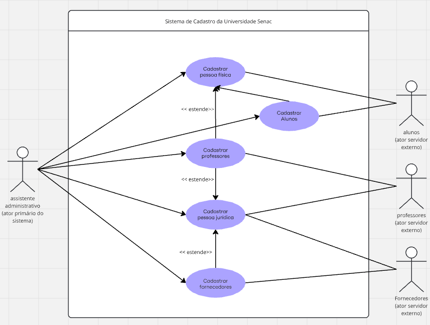
---
### 5. Diagrama de Classes UML
Idealizado com os comportamentos de herança e associação das seis classes criadas.
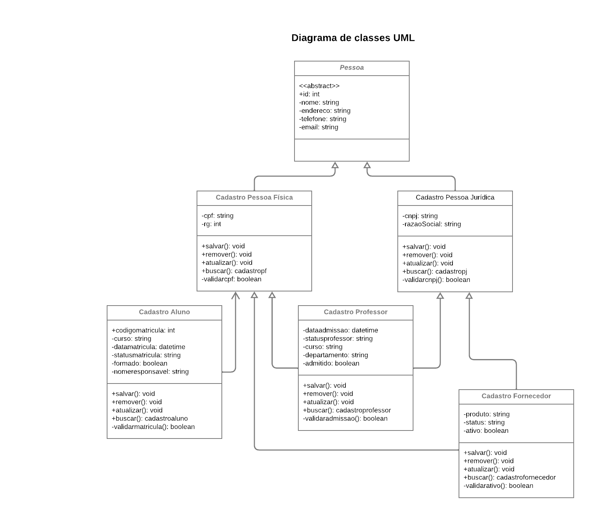
---
### 6. Conclusão
Este trabalho apresentou a modelagem de um sistema para o gerenciamento de dados da Universidade SENAC, utilizando diagramas de caso de uso e de classes. O sistema permite o cadastro de diferentes tipos de pessoas e entidades, abordando as funcionalidades necessárias para o bom funcionamento do processo de gestão acadêmica e administrativa da universidade.
